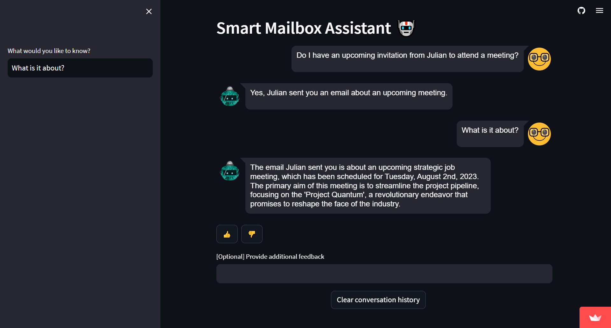

# 📧 Smart Mailbox Assistant

## Content
- [Demo](#demo)
- [Project Description](#project-description)
- [Features](#features)
- [Setup](#setup)
- [Usage](#usage)
- [Contributing](#contributing)
  
## Demo 

[Here's](https://email-knowledge-extraction.streamlit.app/) the final product: 

## Project Description

Smart Mailbox Assistant is a nifty Streamlit-based web application that supercharges your email management experience with the power of AI 🧠! By using OpenAI's language models and integrating with Gmail via Zapier, our assistant provides an intuitive, conversation-like interface for you to interact with your emails.

## Features

* OAuth Authentication: Enjoy a secure environment as the application uses OAuth for authenticating with Zapier, allowing the AI to safely access and interact with your Gmail data.

* Natural Language Commands: Command your email like a boss! The assistant interprets natural language commands for actions such as retrieving emails.

* AI-Powered Responses: Leveraging OpenAI's language models, the assistant provides detailed and relevant responses based on your email data.

* Feedback System: Your feedback matters! Users can provide feedback on the AI's responses, helping to improve the system over time.

## Setup

1. Visit the Smart Mailbox Assistant application on your web browser by navigating to the following link: [Smart Mailbox Assistant](https://email-knowledge-extraction.streamlit.app/)

2. Click on the provided link to authenticate with Zapier. This will prompt you to log in to your email account and allow Zapier to read your emails.

3 .Once authenticated, you are all set to start using the Smart Mailbox Assistant!

## Usage

1. With the application opened and authenticated, enter a natural language command in the provided text field, like "Get the latest email from Alice".

2. The assistant will process your command, interact with your emails, and present the relevant information.

3. After receiving a response, you can give a thumbs-up or thumbs-down and provide additional optional feedback.

## Contributing

Got an idea 💡? Found a bug 🐛? Contributions are welcome! Feel free to open an issue or submit a pull request.
